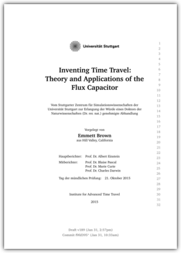
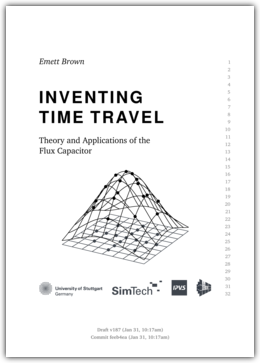
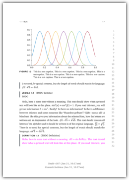
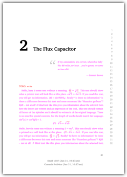

# uni-stuttgart-phdthesis-template

This is an unofficial LuaLATEX template for PhD
theses by and for members of the University of Stuttgart, Germany,
following the university's regulations for PhD theses
(Promotionsordnung).

The template is private work by members of the University of Stuttgart.
It is not endorsed by the University of Stuttgart or any of its
institutions, institutes, or departments.
The template is made available to the public as we think it might
be useful for other people.
Neither the authors nor the University of Stuttgart provide support
for the template going beyond this `README`.

The license for the template is located in `LICENSE`.

If you happen to improve the template, it would be nice if you merged
back your work using pull requests.

## Features

You can download a compiled sample PDF located in `pdf/thesis.pdf`.

* Improved typographic style with KOMA-Script and microtype
* Draft mode: Line numbers, Git commit and compile date as watermark,
  highlighting of overfull hboxes and hyphenation places
* Filtering of LuaLATEX via texfot
* Output to-do notes as warnings to the log file to stay on track
* Consistent figure, sub-figure, algorithm, and theorem style
* Bibliography and glossary
* Automatic generation of graphics with SCons and Matplotlib, figures
  are only recompiled if the PGF code changed

## Requirements

* TEX distribution with LuaLATEX,
  Biber, Makeglossaries, makeindex, texfot, and PDFCROP
  (tested with TeXLive 2017)
* Python 3.x with Matplotlib, NumPy, SciPy
* SCons
* Git

## Usage

Type `scons` in the root directory of the project to compile the
template. The PDF will be placed in `build/pdf/` and copied to
`pdf/`. Type `scons -c` to clean up.

There several modes that can be activated or deactivated in
`tex/switches.tex`:

* *Draft mode:* This shows line numbers and a draft watermark on
  every page. When deactivated, this overrides the settings for
  debug and check modes and deactivates them.
* *Check mode:* This highlights all overfull hboxes with a black bar
  near the box. All places where a word was hyphenated due to
  line wrapping are also highlighted with a black bar.
  Additionally, the hyphenated words are written to the
  end of the log file `build/tex/thesis.log`. To whitelist the
  hyphenation of a word, add it to `hyphenation_whitelist.txt`
  (one word per line, all lowercase, with hyphens where hypenation
  is allowed).
* *Debug mode:* This shows all boxes, glues, and kerning info.
* *Partial compile mode:* This allows to select individual chapters
  to speed up the compilation process. After enabling this mode,
  turn on the respective `compileChapterX` toggle to only compile
  that chapter (without appendices, table of contents, glossary,
  and bibliography).

By default, the draft and the check mode are activated.

On page 4 (back of the second title page), versioning information
is printed (and also on every page, if the draft mode is activated).
This info includes compile time, Git commit time, and the Git commit
hash (with an asterisk if the working directiory is "dirty"). It is
printed by calling Git from a Lua script. If you don't want to
manage your thesis in a Git repository (you do, trust me), then you
might have to change some files. Search for "git" in the
`tex/*.tex` files to know where you have to change something.

Additionally, the versioning info includes a compile counter. The
counter increases on each compile by 1 and is located in the file
`compile_counter.txt`. Removing it should be very easy, if you
don't want this.

## Caveats

* There are some problems with Windows. Calling external processes
  (io.popen) does not seem to work, which means that the version
  info won't be printed.
* The glossary has to be re-generated for every SCons call.
  Otherwise, it may happen that a change in the description of a
  glossary entry won't be reflected in the glossary itself.
